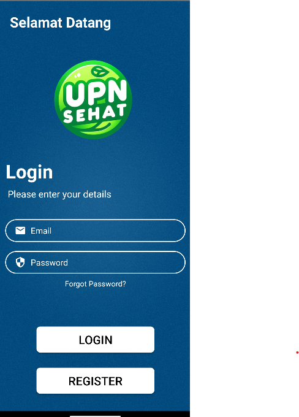
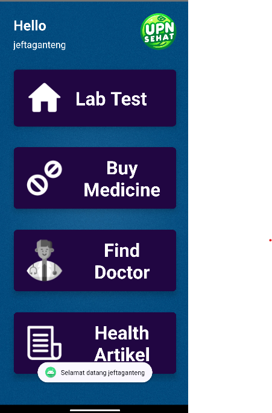
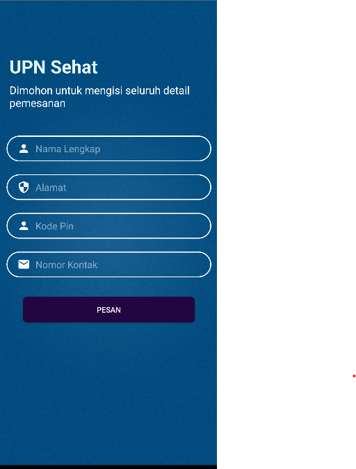
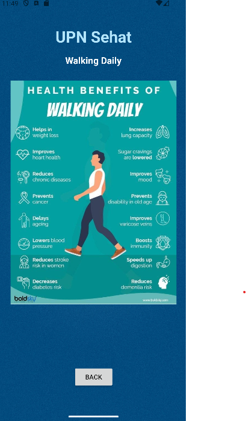
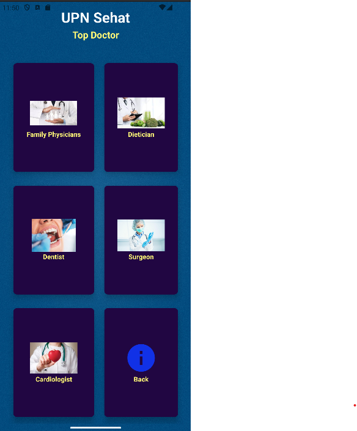

# UPN-Sehat---Mobile-App

Welcome to the UPN-Sehat Mobile App repository. This project is a mobile application aimed at providing health-related services and information to users.

## Table of Contents

- [Introduction](#introduction)
- [Features](#features)
- [Screenshots](#screenshots)
- [Installation](#installation)
- [Usage](#usage)
- [Contributing](#contributing)
- [License](#license)

## Introduction

UPN-Sehat is a mobile application designed to assist users in managing their health and wellness. The app offers a variety of features including appointment booking, health tracking, and access to health information.

## Features

- **User Authentication**: Secure login and registration.
- **Appointment Booking**: Schedule and manage appointments with healthcare providers.
- **Health Tracking**: Monitor health metrics such as weight, blood pressure, and more.
- **Information Access**: Read articles and tips on health and wellness.
- **Notifications**: Receive reminders for appointments and health tips.

## Screenshots

### Login Screen


### Home Screen


### Appointment Booking


### Health Tracking


### Health Information


## Installation

1. **Clone the repository**:
    ```sh
    git clone https://github.com/yourusername/UPN-Sehat---Mobile-App.git
    ```
2. **Navigate to the project directory**:
    ```sh
    cd UPN-Sehat---Mobile-App
    ```
3. **Install dependencies**:
    ```sh
    ./gradlew build
    ```

## Usage

To start using the application, open it on your Android device or emulator and follow the instructions for setting up your account and exploring the features.

## Contributing

We welcome contributions from the community. If you would like to contribute, please follow these steps:

1. **Fork the repository**.
2. **Create a new branch**:
    ```sh
    git checkout -b feature/YourFeature
    ```
3. **Make your changes** and commit them:
    ```sh
    git commit -m 'Add some feature'
    ```
4. **Push to the branch**:
    ```sh
    git push origin feature/YourFeature
    ```
5. **Create a new Pull Request**.

## License

This project is licensed under the MIT License - see the [LICENSE](LICENSE) file for details.
